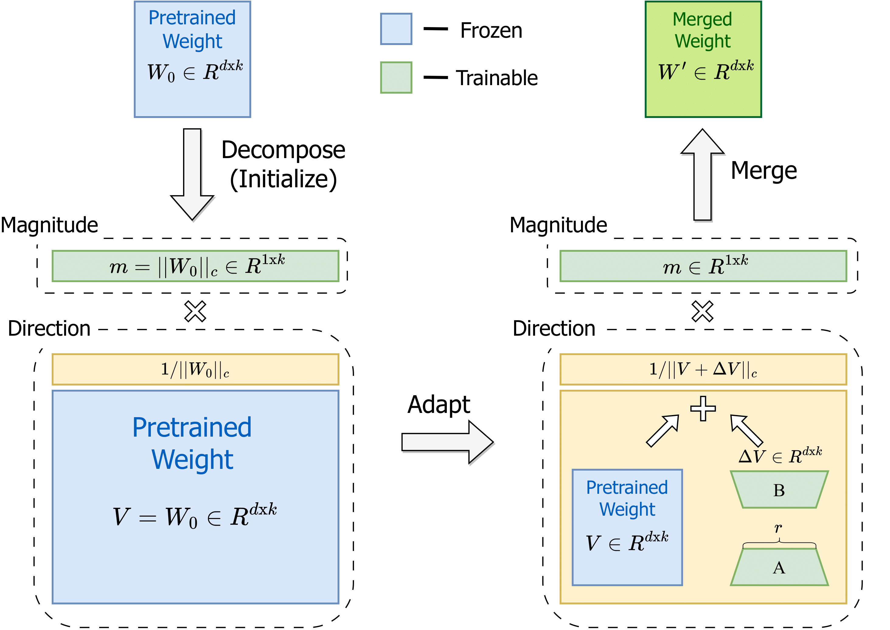

<h1 align="center">
    <p>DoRA: Weight-Decomposed Low-Rank Adaptation</p>
</h1>

<h1 align="center"> 
    
</h1>

The official pytorch implementation of [DoRA](https://arxiv.org/abs/2402.09353).

[](https://github.com/NVlabs/DoRA/stargazers)

## DoRA: Weight-Decomposed Low-Rank Adaptation

[Shih-Yang Liu](https://nbasyl.github.io/), [Chien-Yi Wang](https://chienyiwang.github.io/), [Hongxu Yin](https://hongxu-yin.github.io/), [Pavlo Molchanov](https://www.pmolchanov.com/), [Yu-Chiang Frank Wang](http://vllab.ee.ntu.edu.tw/ycwang.html), [Kwang-Ting Cheng](https://seng.hkust.edu.hk/about/people/faculty/tim-kwang-ting-cheng), [Min-Hung Chen](https://minhungchen.netlify.app/)

[[`Paper`](https://arxiv.org/abs/2402.09353)] [[`Website`](https://nbasyl.github.io/DoRA-project-page/)] [[`BibTeX`](#citation)]

DoRA decomposes the pre-trained weight into two components, magnitude and direction, for fine-tuning, specifically employing LoRA for directional updates to efficiently minimize the number of trainable parameters. By employing DoRA, we enhance both the learning capacity and training stability of LoRA while avoiding any additional inference overhead. DoRA consistently outperforms LoRA on fine-tuning LLaMA, LLaVA, and VL-BART on various downstream tasks, such as commonsense reasoning, visual instruction tuning, and image/video-text understanding.

## 💥 News 💥
- **[04.27.2024]** 🔥🔥 We have added the source code and the DoRA weight for finetuning LLaMA2-7B and LLaMA3-8B on commonsense reasoning tasks!
- **[04.22.2024]** 🔥🔥 Check out a awesome blog post [FSDP/QDoRA](https://www.answer.ai/posts/2024-04-26-fsdp-qdora-llama3.html) from Answer.ai which shows that QDoRA siginificantly outperforms QLoRA and even edges out full finetuning!
- **[04.18.2024]** 🔥🔥 We have released the source code and the DoRA weight for reproducing the results in our paper!
- **[03.20.2024]** 🔥🔥 DoRA is now fully supported by the HuggingFace PEFT package and can now support Linear, Conv1d, and Conv2d layers, as well as linear layers quantized with bitsandbytes! 

## DoRA vs LoRA on the commonsense reasoning tasks 
| Model                 | r |    BoolQ  |  PIQA  |  SIQA  |  HellaS  |  WinoG  |  ARC-e  |  ARC-c  |  OBQA  |  Average  |
|-----------------------|-------|---------|--------|--------|-------------|--------------|---------|---------|--------|-----------|
| LLaMA-7B-LoRA		  |   32  |    67.5  |  80.8  |  78.2  |  83.4  |  80.4   |  78.0   |  62.6   |  79.1  |  76.3     |
| LLaMA-7B-DoRA(ours)	  |  [16](https://drive.google.com/drive/folders/1cKCXN168uv1bWkI00d20FvyVeZTMU8Ky?usp=drive_link)   |    70.0 | 82.6 | 79.7 | 83.2 | 80.6 | 80.6 | 65.4 | 77.6 | **77.5**   |
| LLaMA-7B-DoRA(ours) 	  |  [32](https://drive.google.com/drive/folders/1Kz27h5BqNv3NOLdH2UhDf12C2JtwJe0Q?usp=drive_link)   |   69.7 | 83.4 | 78.6 | 87.2 | 81.0 | 81.9 | 66.2 | 79.2 | **78.4**   |
| LLaMA2-7B-LoRA		  |   32  |   69.8 | 79.9| 79.5| 83.6| 82.6| 79.8|64.7| 81.0| 77.6    |
| LLaMA2-7B-DoRA(ours)		  |  [16](https://drive.google.com/drive/folders/1lMn7WKLw5aQQqwnFnuDpsM3c9FsQtpl2?usp=drive_link)   |   72.0 |83.1 |79.9| 89.1 |83.0| 84.5| 71.0 |81.2 |**80.5**  |
| LLaMA2-7B-DoRA(ours) 	  |  [32](https://drive.google.com/drive/folders/1x2qamDlNRgNtBBi-tPrZ3UTYXdObtskE?usp=drive_link)   |  71.8 |83.7 |76.0 |89.1 |82.6 |83.7 |68.2| 82.4 |**79.7**   |
| LLaMA3-8B-LoRA		  |   32  |   70.8 |85.2| 79.9| 91.7 |84.3 |84.2| 71.2| 79.0| 80.8    |
| LLaMA3-8B-DoRA(ours)		  |  [16](https://drive.google.com/drive/folders/1WHH_c5sGIdybPZt2Cuk0uEQrKtUOAk5v?usp=drive_link)   |  74.5 |88.8 |80.3| 95.5| 84.7| 90.1| 79.1| 87.2| **85.0**   |
| LLaMA3-8B-DoRA(ours) 	  |  [32](https://drive.google.com/drive/folders/107-Qjf-odzG7q7uMonLy_ulwzhE5URgb?usp=drive_link)   |   74.6| 89.3| 79.9 |95.5| 85.6| 90.5| 80.4 |85.8 |**85.2**  |


## Quick Start and some tricks regarding finetuning with DoRA
### HuggingFace PEFT
DoRA is now supported by the [Huggingface PEFT package](https://github.com/huggingface/peft/releases/tag/v0.10.0). You can install the PEFT package using
```bash
pip install git+https://github.com/huggingface/peft.git -q
```

After PEFT is installed, you can simply set the `use_dora` argument of `LoraConfig()` to `True` for applying DoRA.

An example could be as follows:
```bash
from peft import LoraConfig

# Initialize DoRA configuration
config = (
    use_dora=True, ...
)
```
Please refer to the official [documentation](https://huggingface.co/docs/peft/en/developer_guides/lora#weight-decomposed-low-rank-adaptation-dora) for more details.

### HuggingFace Diffusers
You can also toy with DoRA on finetuning diffusion models. See [huggingface/diffusers](https://github.com/huggingface/diffusers/tree/main/examples/advanced_diffusion_training#dora-training). Another good tutorial would be this [Colab notebook](https://colab.research.google.com/drive/134mt7bCMKtCYyYzETfEGKXT1J6J50ydT?usp=sharing#scrollTo=23d6bb49-3469-4e23-baf5-25b2344b599d) from [Linoy Tsaban](https://twitter.com/linoy_tsaban).

In general, DoRA finetuning on diffusion models is still _experimental_ and is likely to require different hyperparameter values to perform best compared to LoRA.
> Specifically, people have noticed 2 differences to take into account in your training: 
> 1. **LoRA seem to converge faster than DoRA** (so a set of parameters that may lead to overfitting when training a LoRA may be working well for a DoRA)
> 2. **DoRA quality superior to LoRA especially in lower ranks**: The difference in quality of DoRA of rank 8 and LoRA of rank 8 appears to be more significant than when training ranks of 32 or 64 for example.  

#### Some DoRA vs. LoRA diffusion finetuning results
- Example From [Linoy Tsaban](https://twitter.com/linoy_tsaban)(Images generated by DoRA are on the left and LoRA on the right):
<h1 align="center"> 
    
</h1>

- Example From [merve](https://twitter.com/mervenoyann):
<h1 align="center"> 
    
</h1>


### DoRA hyperparameters settings
> [!NOTE]
> 💡 While fine-tuning with DoRA, utilizing the configuration of LoRA can already achieve better results most of the time, achieving optimal performance compared to LoRA still requires adjustments to the hyperparameters. 

> We suggest starting with a slightly lower learning rate than that of LoRA, and users may also experiment with varying LoRA dropout ratios.

> User may also start with half of the rank of the LoRA configuration which oftentimes can already result in comparable or even superior accuracy compared to that of LoRA.

## Reproducing the results in the paper

This repo contains four directories:

`./commonsense_reasoning` contains the code to finetune LLaMA-7B/13B using DoRA on the commonsense reasoning tasks. This directory is modified based on [LLM-Adapter](https://github.com/AGI-Edgerunners/LLM-Adapters).

`./instruction_tuning` contains the code to finetune LLaMA-7B and LLaMA2-7B using DoRA and DVoRA (DoRA+VeRA) with the cleaned Alpaca instruction tuning dataset. This directory is modified based on [VeRA](https://openreview.net/attachment?id=NjNfLdxr3A&name=supplementary_material).

`./image_video_text_understanding` contains the code to finetune VL-BART using DoRA for the image/video-text understanding tasks. This directory is modified based on [VL-Adapter](https://github.com/ylsung/VL_adapter).

`./visual_instruction_tuning` contains the code to finetune LLaVA-1.5-7B on the visual instruction tuning tasks with DoRA. This directory is modified based on [LLaVA](https://github.com/haotian-liu/LLaVA).


## Contact
Shih-Yang Liu: [shihyangl@nvidia.com](shihyangl@nvidia.com) or [sliuau@connect.ust.hk](sliuau@connect.ust.hk)

## Citation
If you find DoRA useful, please cite it by using the following BibTeX entry.
```bibtex
@article{liu2024dora,
  title={DoRA: Weight-Decomposed Low-Rank Adaptation},
  author={Liu, Shih-Yang and Wang, Chien-Yi and Yin, Hongxu and Molchanov, Pavlo and Wang, Yu-Chiang Frank and Cheng, Kwang-Ting and Chen, Min-Hung},
  journal={arXiv preprint arXiv:2402.09353},
  year={2024}
}
```

## Star History

[](https://star-history.com/#NVlabs/DoRA&Date)


## Licenses
Copyright © 2024, NVIDIA Corporation. All rights reserved.

This work is made available under the NVIDIA Source Code License-NC. Click [here](https://github.com/nbasyl/DoRA/LICENSE) to view a copy of this license.

